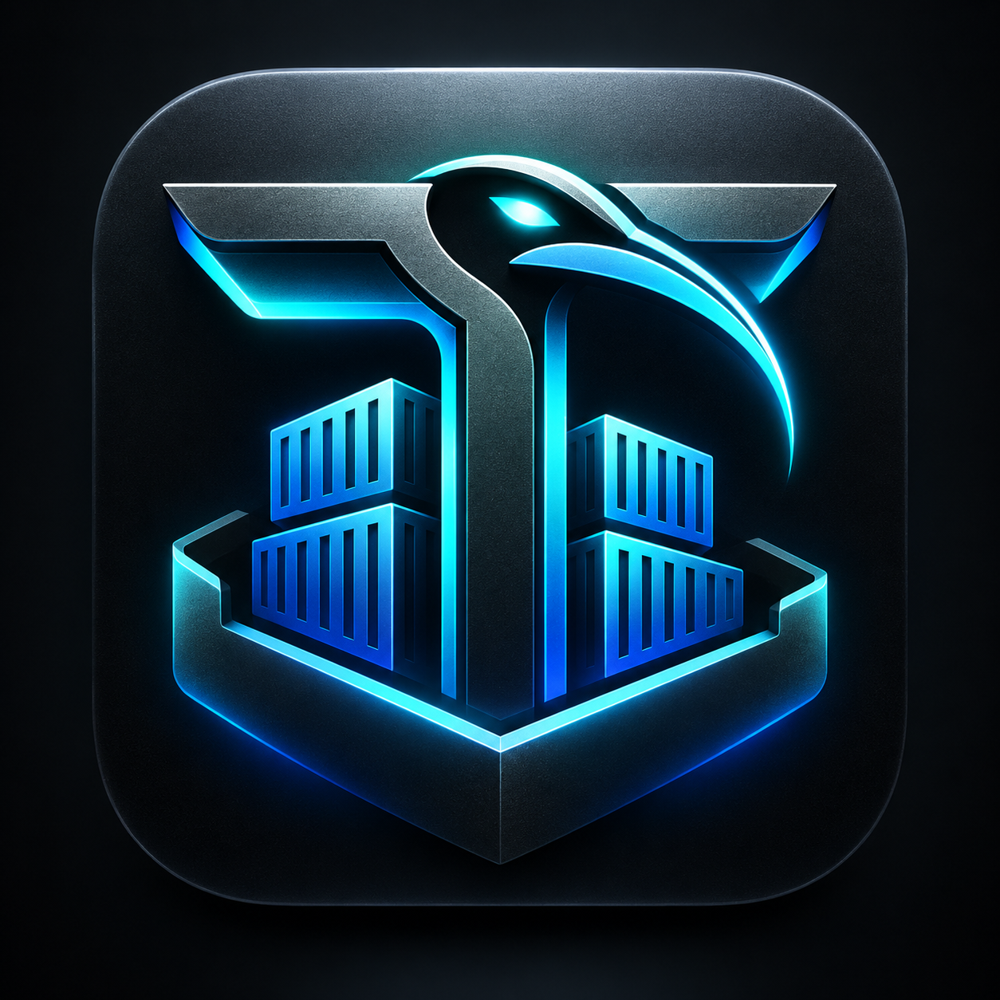

<p align="center"></p>

# ThothDock

**A Docker-compatible userspace container engine for unrooted Android.**

ThothDock speaks the Docker Engine API (v1.41) on a Unix socket, so an
ordinary, unmodified Docker CLI can pull images, create, run, attach to,
log, stop and remove containers. It runs no `dockerd`, `containerd` or `runc`.
Containers run through a userspace runtime instead: the PRoot that the
[ThothTerm Garden](https://github.com/Lord1Egypt/AndroidThothTerm) editions
already ship on Android.

```
Docker CLI ──Docker Engine API 1.41──▶ thothdock serve
                                         ├─ OCI registry client, digest-verified blob store
                                         ├─ secure layer extraction (whiteouts, opaque dirs)
                                         ├─ image store / per-container root filesystem
                                         ├─ container state, json-file logs, attach, TTYs
                                         └─ PRoot runtime ──▶ Garden PRoot ──▶ Android kernel
```

ThothDock is an independent project. It is **not affiliated with Docker, Inc.**

## What works (verified)

Verified on 2026-10-04 with Docker CLI 29.8.1. The phone was a Samsung SM-A165F
running Android 16, unrooted, with the PRoot from ThothTerm Trixie 0.2.1. The PC
was x86_64 Linux. See [docs/evidence/PHASE1.md](docs/evidence/PHASE1.md) for the
transcripts.

- `docker version`, `docker info`, `docker ps`, `docker images`
- `docker pull` from Docker Hub. The engine selects the platform from a manifest list, verifies every blob's digest and size and every layer's diff ID, and applies whiteouts and opaque directories.
- `docker run` and `docker run --rm`, with exit codes and the error messages the CLI maps to exit codes 125, 126 and 127.
- Piped stdin with `docker run -i`, and interactive TTY sessions with `docker run -it alpine sh` or `docker run -it debian bash`, including window resizing.
- `docker run -d`, `logs` (`-f`, `-t`, `--tail`), `stop` (stop signal, then SIGKILL), `start`, `restart`, `kill`, `wait`, `inspect`, `rm`, `container prune`, `rmi`, `tag`, `history`.
- `apk add` inside Alpine and `apt-get update && apt-get install` inside Debian, on the phone.

## What does not work, and why

PRoot is a ptrace-based userspace translator. It is not a kernel container.
ThothDock therefore has **no namespaces, no cgroups, no capabilities and no
seccomp profiles**, and containers are **not a security boundary**. A flag that
needs those features is refused with an explanation rather than accepted and
then ignored:

```
$ docker run --memory 64m alpine true
docker: Error response from daemon: ThothDock does not support memory limits:
containers run under PRoot without cgroups, so the limit would not be enforced
```

Containers share the device network and process table. `docker exec`, named
volumes, port publishing, networks, build, and Compose are planned.
[docs/COMPATIBILITY.md](docs/COMPATIBILITY.md) has the full table, and
[docs/SECURITY_MODEL.md](docs/SECURITY_MODEL.md) has the threat model.

## Quick start (Linux host, for development)

```sh
scripts/build-host-proot.sh ~/proot      # termux/proot at Garden's pin; needs libtalloc-dev
go build -o thothdock ./cmd/thothdock
./thothdock serve --proot ~/proot/proot
# in another shell:
export DOCKER_HOST=unix://$HOME/.local/share/thothdock/run/thothdock.sock
docker run --rm -it alpine sh
```

`thothdock doctor` checks a device or host before you start, and
`thothdock inspect-store [-verify]` and `thothdock gc` maintain the store while
the daemon is stopped.

## On Android

ThothDock runs inside a ThothTerm app. In the isolated QA build
`com.thothterm.debian.qa.thothdock` (AndroidThothTerm branch
`qa/thothdock-integration`), you open the terminal and type `docker …`:

```
ThothTerm terminal ─ Docker CLI ─ unix:///run/thothdock/thothdock.sock
        Android app context ─ ThothDock daemon ─ Garden PRoot ─ container rootfs
```

The stock Docker CLI (29.8.1) is bundled unmodified; `dockerd`, `containerd` and
`runc` are not. See [docs/GARDEN_RUNTIME_NOTES.md](docs/GARDEN_RUNTIME_NOTES.md)
for the architecture, the measured lifecycle behaviour and the limits, and
[docs/branding/VISUAL_IDENTITY.md](docs/branding/VISUAL_IDENTITY.md) for the
look. Nothing is merged into any ThothTerm production edition yet.

## Development

```sh
go test -race ./...                                   # runtime tests skip without a PRoot
THOTHDOCK_TEST_PROOT=~/proot/proot go test -race ./... # all tests
SMOKE_PULL=1 tests/smoke/docker-cli-smoke.sh ./thothdock ~/proot/proot
```

Zero dependencies outside the Go standard library except `golang.org/x/sys`.
See [docs/ARCHITECTURE.md](docs/ARCHITECTURE.md) for the design.

## License

Apache-2.0. PRoot, which ThothDock runs but does not include, is GPL-2.0.
