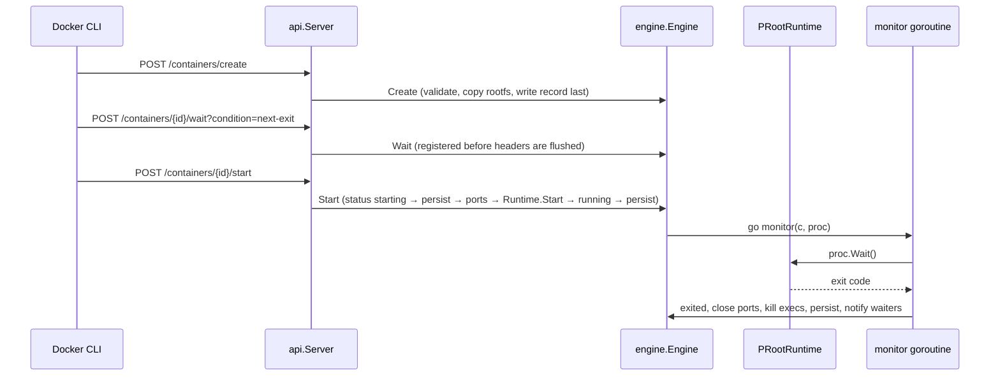

# ThothDock architecture — current state (audit, ticket P0-01)

Audited 2026-10-10 at engine `v0.1.1` (`814e193`) and Android
`trixie-v0.3.1` (`6959201`, package `com.thothterm.debian`). This document
maps what exists. The target design is in `SYSTEM_HLD.md`; what changed in
the next-generation work is in `phases/`.

## Process structure on the device

```mermaid
flowchart LR
    subgraph app["Android app process (uid u0_aNNN), foreground service type specialUse"]
        J[ThothDock.java supervisor thread]
        UI[ContainersActivity / ApiClient]
    end
    J -- fork/exec, --exit-with-parent --> D[libthothdock.so serve]
    D -- Unix socket files/thothdock/sock 0600 --> CLI
    UI -- same socket --> D
    subgraph guest["Debian 13 guest (Garden PRoot)"]
        CLI[stock Docker CLI 29.8.1 libdocker.so, DOCKER_HOST=/run/thothdock/thothdock.sock]
    end
    D -- one PRoot per container process --> P1[libproot.so --kill-on-exit] --> W1[workload]
    D --> P2[libproot.so] --> W2[workload + children]
```

- The daemon is never nested inside the guest's PRoot. Nested PRoot was
  measured to fail (bionic linker config, nested ptrace `execve`).
- `ThothDock.java` restarts a daemon that dies unexpectedly: at most a bounded
  number of times per window, with exponential backoff, and it gives up until
  the next session. It removes a stale socket first.
- The daemon exits with its parent (`--exit-with-parent`). Containers die with
  the daemon (`Pdeathsig=SIGKILL` on PRoot, `--kill-on-exit`, `PTRACE_O_EXITKILL`).

## Module ownership map

| Package | Owns | Verified capabilities | Limits found in the audit |
|---|---|---|---|
| `cmd/thothdock` | `serve`, `doctor`, `inspect-store`, `gc`, `guard`, `version`; flags; socket creation and lock; shutdown | single daemon per root (flock); 0600 socket in an owner-only directory; `--dev-tcp` loopback only | none blocking |
| `internal/api` | Docker Engine API 1.41 router, version negotiation, errors, container/image/volume/exec/system handlers, attach hijack, log framing | stock CLI 29.8.1 end to end (host and phone) | `/networks` and `/events` return 501; `ps` reports every container as `host` network |
| `internal/engine` | container object model, persistence, create policy, lifecycle, exec, mounts, ports, guest files (`hosts`, `hostname`, `resolv.conf`) | explicit states `created/starting/running/exited/failed/removing`; atomic record writes; PID+start-time reconcile; `--rm`; waiters registered before start | restart policy other than `no` refused; no events; no network model; `RestartCount` only incremented by `docker restart` |
| `internal/runtime` | `Runtime` interface; `PRootRuntime`; `FakeRuntime`; PTYs | process group or session per container; stop signal to the group; SIGKILL kills the tree; `128+N` exit codes | PRoot options fixed per container; no per-container network option |
| `internal/procid` | PID identity (`/proc/<pid>/stat` start time), group kill | PID reuse never mistaken for a container (tests) | — |
| `internal/portmap` | userspace TCP forwarder (`-p`) | listener bound before start; collision fails `run`; closed on stop/rm/exit/crash | always dials `127.0.0.1:<container port>`; one goroutine pair per connection (no idle cost) |
| `internal/image`, `registry`, `oci`, `layer`, `securefs`, `store` | pull, verify, extract, store | digest-verified, size-bounded, hostile-tar tests, ceilings (v0.1.1) | zstd layers unsupported; no push/build |
| `internal/volume` | named volumes | in-use protection, symlink-safe removal | no copy-up, no drivers |
| `internal/logs` | json-file logs, rotation, live subscriptions | `logs -f`, `--since/--until/--tail` | — |
| `internal/guard` + `engine-guard/` | Engine Guard placeholder packages, apt pin, dpkg hook | apt v3 parser tested against real apt | — |
| Android `ThothDock.java` | daemon supervision, socket bind into the guest, `DOCKER_HOST` | lifecycle matrix on the SM-A165F (RC evidence) | containers never outlive the daemon; no restore after relaunch |
| Android `ContainersActivity`, `ApiClient` | Containers screen (list, Start, Stop, Restart, Logs, Shell, Delete) | client of the API only, no own state | no Images/Volumes/Networks/Stacks screens |

## Event and state flow today



One goroutine per running container blocks in `wait4`; it costs no CPU and
no wakeups while the container runs. That is the property every new
subsystem must keep (`PERFORMANCE_BUDGET.md`).

## Recovery primitives that already exist

- Record written last on create; a directory without `config.json` is removed
  at start.
- `removing` state finished at start.
- `running`/`starting` records reconciled against `/proc` by PID and start
  time; a survivor is killed, the record becomes `exited (137)` with an
  explanation.
- `tmp/` staging emptied at start (pull and extraction are all-or-nothing).
- Android side: stale socket and pid file of a force-stopped daemon removed at
  the next launch; the leftover daemon is found by its pid file and killed only
  if its start time matches.
