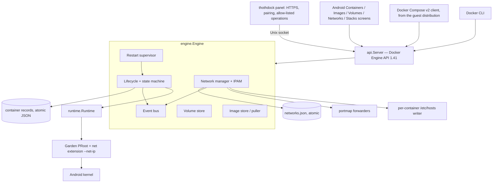
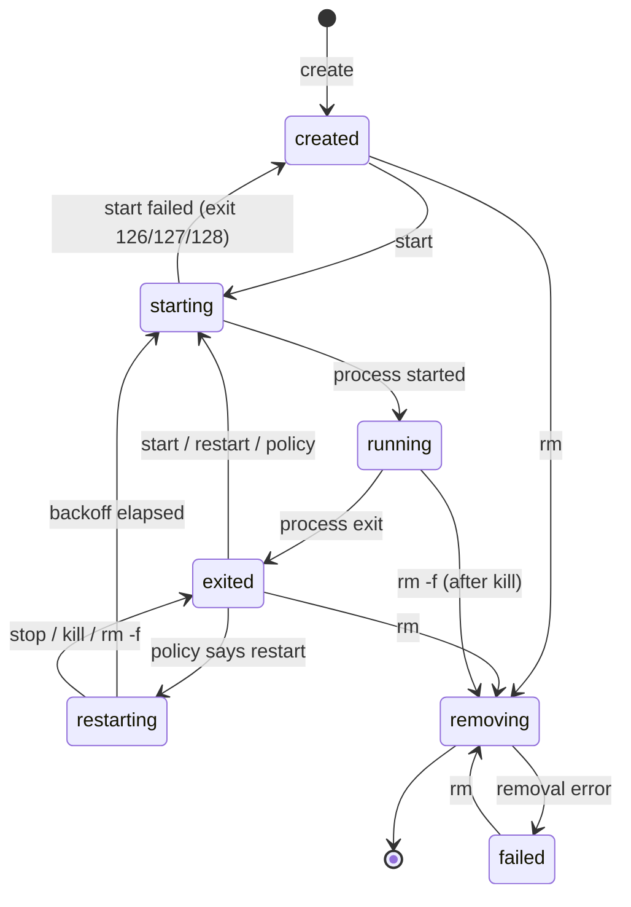
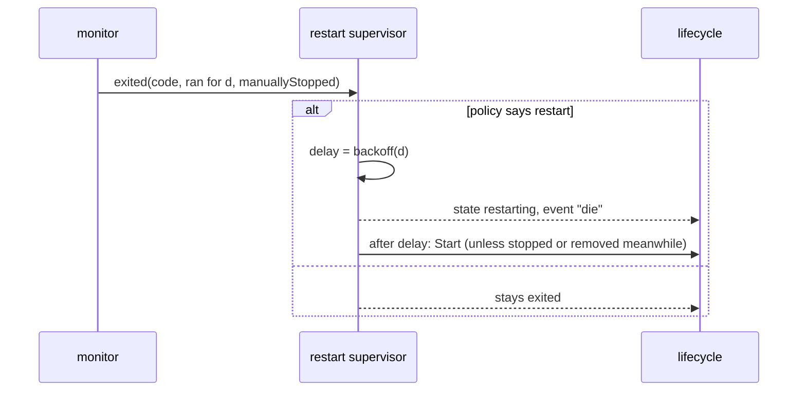
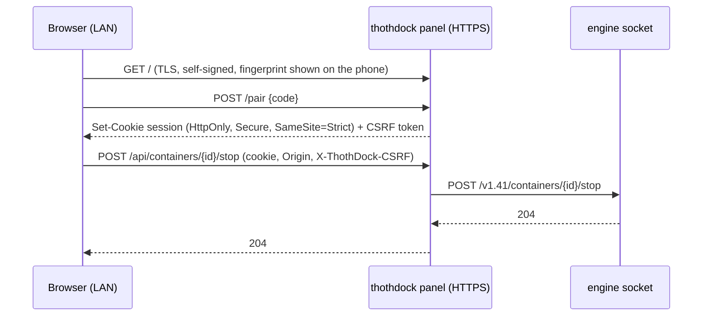

# ThothDock next generation — high-level design

Status of each component: **EXISTS** (v0.1.1), **NEW** (this programme),
**PLANNED** (designed here, not implemented yet). `TICKETS.md` holds the
current implementation state; this document holds the design.

## 1. Component view



| Component | Status | Ticket | Resident cost when idle |
|---|---|---|---|
| Engine API, lifecycle, images, volumes, logs, exec, ports | EXISTS | — | one blocked goroutine per running container |
| State-machine guard (`transition`) | NEW | P1-01 | none |
| Event bus (`/events`) | NEW | P1-02 | none without subscribers |
| Restart supervisor | NEW | P3-01..03 | none; one timer per container that is waiting to restart |
| Network manager, IPAM, hosts writer, `/networks` | NEW | P2-01, P2-03 | none |
| PRoot net extension (`--net-ip`) | NEW (Garden patch 0009) | P2-02 | none; work happens in syscall stops PRoot already takes |
| Compose compatibility | NEW (API work + tests) | P4-* | none |
| Web Panel (`thothdock panel`) | NEW | P6-* | zero when off (separate process) |
| Android Images/Volumes/Networks/Stacks screens | PLANNED | P5-* | zero when closed |
| Server Mode (boot start, restore) | PLANNED | P7-* | the existing foreground service |

## 2. Container lifecycle (P1-01, P3)



`restarting` is the one new state. The engine refuses any other transition
with a 409 instead of silently overwriting state.

## 3. Networking (ADR-0002)

```mermaid
flowchart LR
    subgraph dev[Android device loopback 127.0.0.0/8]
        F[portmap forwarder 127.0.0.1:8080] --> A
        subgraph netA[network myapp_default]
            A[web: 127.77.0.2 — binds 0.0.0.0:80 → 127.77.0.2:30080]
            B[api: 127.77.0.3 — binds :::3000 → ::ffff:127.77.0.3:3000]
        end
        A -- connect api:3000 via /etc/hosts --> B
        GW[127.77.0.1 gateway → device 127.0.0.1]
    end
    LAN[LAN client] -. no route: workload is not on 0.0.0.0 .-> A
```

- **Addressing:** one address per network-attached container, from
  `127.77.0.0/16` (`.0.1` is the gateway, `.255.255` reserved).
- **Discovery:** each attached container's `/etc/hosts` lists itself, every
  peer on every network it shares (container name, Compose service and
  aliases, short ID), `host.docker.internal` and `gateway.docker.internal`
  (both the gateway address).
- **Publishing:** the forwarder dials `<container address>:<shifted port>`.
- **Isolation policy (P2-04):** membership decides which names a container
  sees. Connection filtering by membership is a planned extension of the PRoot
  rule set. It is a convenience, not a security boundary.

## 4. Events (ADR-0003)

Producers: lifecycle (`create`, `start`, `die`, `stop`, `kill`, `restart`,
`destroy`, `rename`), images (`pull`, `tag`, `untag`, `delete`), networks
(`create`, `connect`, `disconnect`, `destroy`), volumes (`create`, `mount`,
`destroy`). Consumers: `GET /events` (filters `type`, `container`, `event`,
`label`, `image`, `network`, `volume`; `since`, `until`), the restart
supervisor (in-process), the Web Panel (via the socket).

## 5. Restart supervisor (ADR-0004)



## 6. Web Panel (ADR-0005)



## 7. Android integration

- The engine stays a child of the app process; it is started by the
  supervisor in `ThothDock.java` and dies with it.
- At engine start, restart policies restore containers (P3-03), so a
  relaunch after Android killed the app restores the workloads.
- Server Mode (P7) adds a boot receiver that starts the foreground service
  only when the owner enabled it. There are no wake locks and no polling.
- The panel is started and stopped from the Containers screen menu. The
  screen shows its URL, certificate fingerprint and pairing code.

## 8. What will not be built on stock Android

Kernel namespaces, cgroup limits, seccomp/AppArmor profiles, `--privileged`,
devices, `pause` (freezer), true `--network none` isolation, and multi-arch
emulation. Each is refused with an explicit 501 and listed in
`COMPATIBILITY_MATRIX.md`.
